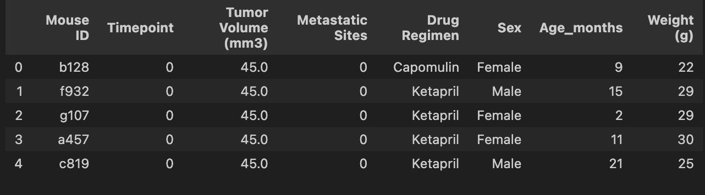
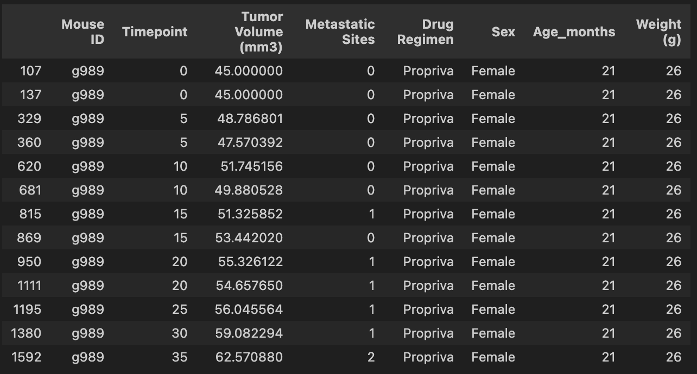
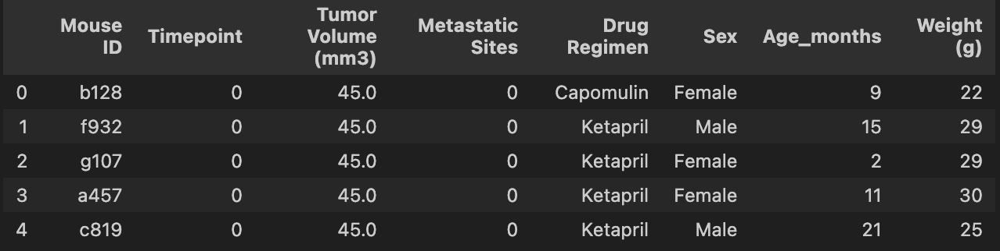
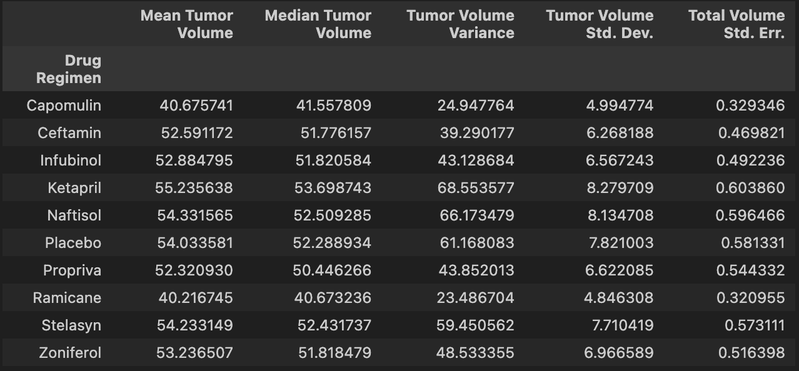
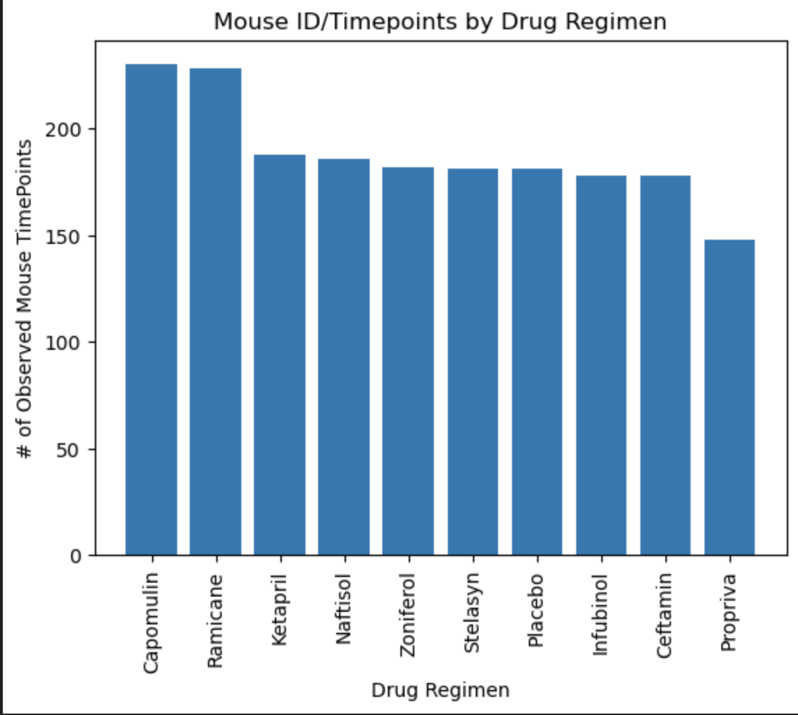
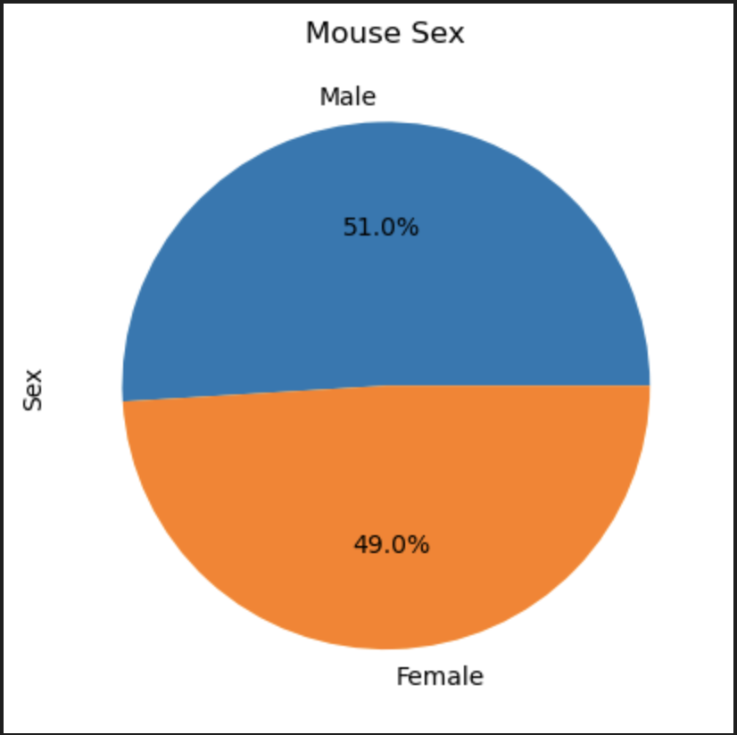
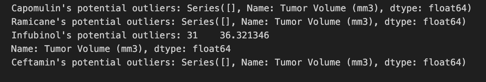
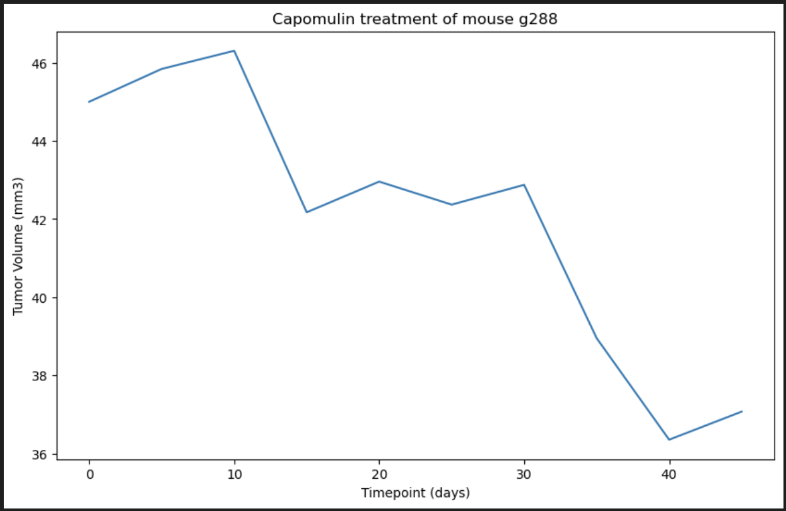
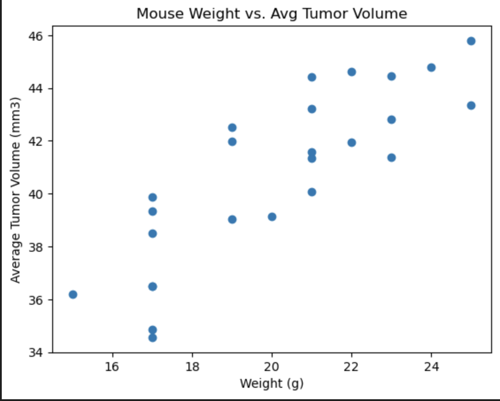
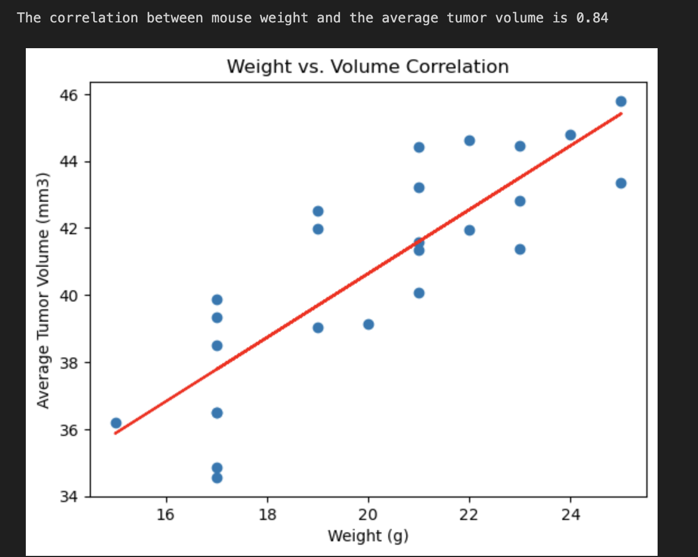

#Pymaceuticals Analysis

##Overview
The purpose of the Module 5 Challenge is to help a new pharmaceutical company that specializes in anti-cancer medications,Pymaceuticals,Inc..Pymaceuticals recently began testing for potential treatemnts for squamous cell carcinoma(SCC), a common form of skin cancer. We have been provided the data from their most recent study. In this study, 249 mice with SCC tumors received treatement with a range of drug regimens. During the 45 day treatment period, the tumor volume of each mouse was observed and measured in order to compare the performance of Pymaceuticals' drug, Capomulin, to the other treatments regimens. To help with the study, we generated the tables and figures needed for the techincal report of the clinical study and a top-level summary of the study results. 

##Instructions
    1. Prepare the data
    2. Generate summary statistics 
    3. Create bar charts and pie charts
    4. Calculate quartiles, find outliers, and create box plot
    5. Create a line plot and a scatter plot
    6. Calculate correlation and regression 
    7. Provide top-level summary and analysis of the study results 

##Files
 - "module_5_challenge"(https://github.com/jackthomas1430/module_5_challenge.git): The main repo for this challenge. 
    -"data" folder: contains the the csv files used for the analysis 
        -“Mouse_metadata.csv”: contains basic information for the 249 mice in the study, which are presented in the following columns: "Mouse ID","Drug Regimen", "Age_months","Weight (g)" 
        -“Study_results.csv”: displays the study results in the following columns:"Mouse ID", "Timepoint","Tumor Volume (mm3)","Metastatic Sites"
    -"Results/Images": contains images of all the results
    -"pymaceuticals_analysis.ipynb": the main script for analysis
    
##Set Up
    1. Clone the repository to your local device using git clone https://github.com/jackthomas1430/module_5_challenge.git
    2. Check that the “Mouse_metadata.csv” and “Study_results.csv” are located in the "data" folder
    3. Open "pymaceuticals_analysis.ipynb"
    4. Run all cells
    
##Results 

##Summary/Analysis 

Out of all the drug treatment groups, Capomulin and Ramicane have the most promising results. The summary statistics table shows that these two have the smallest mean and median tumor volumes. Ketapril has the largest average tumor volume at 55.2 mm3, while Capomulin has the second smallest at 40.68 mm3 and Ramicane has the smallest at 40.22 mm3. Capomulin and Ramicane are the only two drug regimens that have an average tumor volume below 50 mm3. It is important to note that both of these drugs also have the smallest variance and standard deviation in the group. They also have the largest sample size, as they have the highest number of observed mouse timepoints. 

The effectiveness of Capomulin and Ramicane is further supported by the "Distribution of Tumor Volume by Treatment Group" box plot, which charts the distribution of final tumor volumes for each of the four most promising treatment regimens: Capomulin, Ramicane, Infubinol, and Ceftamin. The plot shows that Infubinol and Ceftamin have higher variability in treatment outcomes and that Infubinol has the most significant outliers. This data might suggest that Infubinol and Ceftamin work well on some mice, while being less effective on others. The variance in tumor size may be related to other underlying factors and pre-exisisting conditions that are not accounted for in the study. 

The "Mouse Weight vs. Avg Tumor Volume" scatter plots present the potential impact that mouse weight has on tumor size. The correlation coefficient between mouse weight and the average tumor volume is 0.84, suggesting a strong positive correlation between the two. As mice increase in size, their tumors tend to increase in size as well. In order to get the most accurate results, the average weight of the mice must remain consistent across the treatment groups.  

The line plot for a single mouse treated with Capomulin is a positive indication for the potential effectiveness of the Capomulin treatment, as it shows the tumor volume decreasing throughout the 45 day treatment period. Creating a similar visual representation for every mouse in the study may indicate a need to further investigate the efficacy of Capomulin towards the end of the 45 day treatment period. The line chart for a single mouse shows that there are some instances in which the tumor volume begins to spike between the 30 to 45 day mark. However, this observation is based on too small of a sample size to make any meaningful conclusions.  

##Acknowledgements
    
    Xpert Learning Assistant was used to answer detailed questions, and assist in debugging.The starter code provided was the base of the report and was modified using course curriculum and activities to fit the requirements of the assignment. The TA and instructor for the course also assisted in adjusting the code during office hours.For more information about the Xpert Learning Assistant, visit [EdX Xpert Learning Assistant](https://www.edx.org/). 

## References

1. SciPy Documentation. (2024). `scipy.stats.linregress`. Retrieved from [https://docs.scipy.org/doc/scipy/reference/generated/scipy.stats.linregress.html](https://docs.scipy.org/doc/scipy/reference/generated/scipy.stats.linregress.html)

2. SciPy Documentation. (2024). `scipy.stats.sem`. Retrieved from [https://docs.scipy.org/doc/scipy/reference/generated/scipy.stats.sem.html](https://docs.scipy.org/doc/scipy/reference/generated/scipy.stats.sem.html)

3. pandas Documentation. (2024). `pandas.DataFrame.plot`. Retrieved from [https://pandas.pydata.org/docs/reference/api/pandas.DataFrame.plot.html](https://pandas.pydata.org/docs/reference/api/pandas.DataFrame.plot.html)

4. pandas Documentation. (2024). `pandas.merge`. Retrieved from [https://pandas.pydata.org/docs/reference/api/pandas.merge.html](https://pandas.pydata.org/docs/reference/api/pandas.merge.html)

5. pandas Documentation. (2024). `pandas.cut`. Retrieved from [https://pandas.pydata.org/docs/reference/api/pandas.cut.html](https://pandas.pydata.org/docs/reference/api/pandas.cut.html)

6. Matplotlib Documentation. (2024). Pyplot Summary. Retrieved from [https://matplotlib.org/stable/api/pyplot_summary.html](https://matplotlib.org/stable/api/pyplot_summary.html)

7. Matplotlib Documentation. (2024). Pie and Polar Charts: Pie Features. Retrieved from [https://matplotlib.org/stable/gallery/pie_and_polar_charts/pie_features.html](https://matplotlib.org/stable/gallery/pie_and_polar_charts/pie_features.html)

Data for this dataset was generated by edX Boot Camps LLC

© 2022 edX Boot Camps LLC. Confidential and Proprietary. All Rights Reserved.
Data generated by MockarooLinks to an external site., LLC (2022). Realistic Data Generator.

